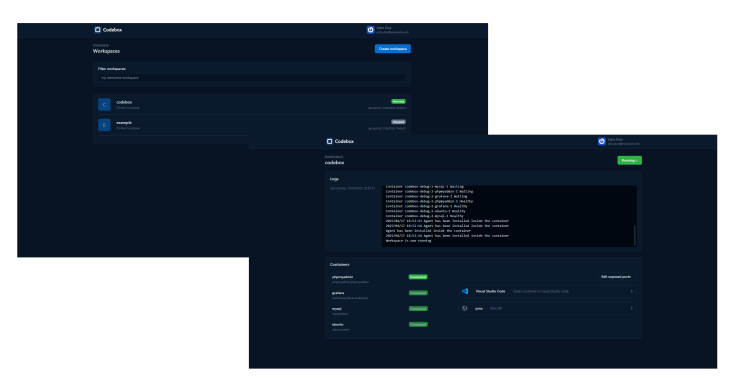

<div align="center">
  

  <h3>
    Remote Development Environments
  </h3>
    <a href="https://hub.docker.com/r/dadebia/codebox" style="text-decoration: none">
      
    </a>
    <a href="https://hub.docker.com/r/dadebia/codebox" style="text-decoration: none">
      
    </a>
    <a href="./LICENSE.txt" style="text-decoration: none">
      
    </a>
  <br>
</div>

> [!WARNING]  
> This software is in beta version, some important changes can be made.

Codebox is a self-hosted distributed provider of remote development environments.

**What does that mean?** With Codebox you can define the resources and the structure of a workspace using standard formats like Docker Compose or Devcontainers. Moreover it provides connection to the workspaces through an SSH connection and the possibility to expose to everyone or with restrictions HTTP services running inside the containers.

<!-- <div align="center">
  
  <br>
</div> -->


## Quickstart

The easiest way to deploy your Codebox instance is using the [docker compose](./docker-compose.yml) provided in this repository.

```bash
curl --output docker-compose.yml "https://gitlab.com/api/v4/projects/68940432/repository/files/docker-compose.yml/raw?ref=master"
```

You have to export some environment variables before starting docker containers:
- `CODEBOX_EXTERNAL_URL`: the url of the codebox instance
- `CODEBOX_WILDCARD_DOMAIN`: codebox allows you to expose ports running HTTP-based services either public or with password authentication. The ports will be exposed through subdomains of this domain. You will need to define a DNS record with a name such as *.codebox.my-domain.com. If you don't want do use this feature you can disable it using `CODEBOX_USE_SUBDOMAINS` environment variable.

A list of all the settings is available [here](https://codebox4073715.gitlab.io/codebox/guide/server/configuration.html).

Now you can start the docker stack with command:
```bash
docker compose up
```

## How does codebox work?

With Codebox you can define the resources and the structure of a workspace using standard formats like Docker Compose or Devcontainers. Moreover it provides connection to the workspaces through an SSH connection and the possibility to expose to everyone or with restrictions HTTP services running inside the containers.

Codebox consists in four main parts:

### 1. A central server with web UI
This is where you can view, create and manage workspaces. The UI provides also an editor for workspace templates and admin tools to manage the server and the connected services. The source code is available [here](https://gitlab.com/codebox4073715/codebox), it's also mirrored on github [here](https://github.com/davidebianchi03/codebox).

### 2. Runners that host and manage the workspaces
Here’s where Codebox’s architecture becomes flexible. Workspaces are not managed directly from the server. Instead, you register runners, each capable of running different type of running one or more workspace types. This leads to several benefits including the fact that the workload can be divided between multiple machines.

Runners must be able to reach the main server, but not the vice versa. In this way you can register runners from multiple locations without opening ports on routers. The source code is available [here](https://gitlab.com/codebox4073715/codebox-docker-runner)

### 3. Agents running inside containers
Agents are running inside workspaces, they provide the connections to the containers. They have an integrated SSH server. The SSH connection is tunneled over Web Sockets, in this way you don’t need to open other ports on your router. The source code is available [here](https://gitlab.com/codebox4073715/codebox-agent)

### 4. A CLI for connecting via SSH (tunneled over HTTP)
The CLI is a component to install on users’ PCs. It provides an SSH proxy to connect via an SSH connection to the workspaces. The source code is available [here](https://gitlab.com/codebox4073715/codebox-cli).

You can also use the official VS Code extension that wraps the CLI and provides an easy way to connect to workspaces. The source code of the extension is available [here](https://gitlab.com/codebox4073715/codebox-vscode-extension)

## Support
Feel free to open an issue if you have any question, find a bug or have a feature request.
