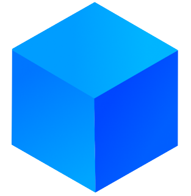

<div style="display: flex; align-items:center; justify-content:center;">
    
    <p style="font-size:40px; font-weight: bold; margin-top:10px; margin-left: 7px; font-family: Consolas;">Codebox</p>
</div>
<hr/>

**Codebox** is a service that allows developers to create remote workspaces based on docker containers. Codebox workspaces are based on [Devcontainers specification](https://containers.dev/). 

## Quickstart

The easiest way to deploy your Codebox instance is using [docker compose](./docker-compose.yml) provided in this repository.

```yaml
version: '3'

services:
  redis:
    image: redis:7.4.1
    restart: always

  codebox:
    image: dadebia/codebox:latest
    ports:
      - ${CODEBOX_PORT:-12800}:8000
    volumes:
      - codeboxdb:/codebox/db
      - codeboxdata:/codebox/data
      - /var/run/docker.sock:/var/run/docker.sock
    environment:
      - CODEBOX_USE_GRAVATAR=true
      - CODEBOX_USE_SUBDOMAINS=true
      - CODEBOX_WORKSPACE_OBJECTS_PREFIX=codebox
    restart: always

volumes:
  codeboxdb:
  codeboxdata:
```

## Connect to workspace container

You can connect to a running workspace container using [**codebox-cli**](https://github.com/davidebianchi03/codebox-cli). Use official [**VS Code Extension**](https://github.com/davidebianchi03/codebox-cli) to open any workspace in VS Code with a single click.
