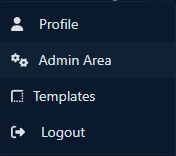
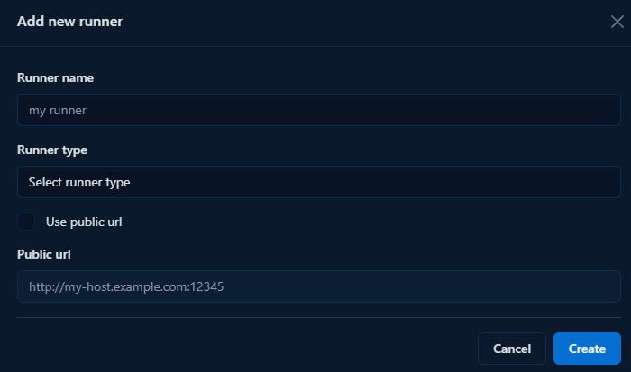

# Runner

To run workspaces, a runner is required. The runner connects to the Codebox server and is used to manage workspaces. You can find a guide here on how to set up a runner.

```{warning}
   A runner can be connected to only one server. If you want to share a machine across multiple Codebox instances, you need to define a separate runner for each instance.
```

```{warning}
   A runner can be registered only by administrators.
```

## Register new runner

Before starting a new runner instance, you must first register it on the Codebox server. This process will generate a token and an ID for the runner. You can find a guide on how to create a new runner here:

1. Go to the Admin Area by clicking on 'Admin Area' in the dropdown menu under your user details in the top-right corner.



2. Under the section 'Runners' click on 'Add new runner'


3. Enter the name and type of the runner. If you want to use a public URL, also provide the runner's public URL. (Note: using a public URL is more stable but requires that the server can reach the runner.)



4. Copy the ID and token — you're now ready to install the Runner.

## Deploy the runner

The recommended installation procedure involves using the Docker stack defined in the `docker-compose.yml` file found in the runner repository.

### Docker Compose installation (recommended)

```{warning}
   Docker and Docker Compose are required, please install them before proceeding.
```

To install Codebox Runner, the first step is to download the `docker-compose.yml` file using the following command:

```bash
wget https://gitlab.com/api/v4/projects/69007830/repository/files/docker-compose.yml/raw?ref=main -O docker-compose.yml
```

or if you prefer to use curl:

```bash
curl --output docker-compose.yml "https://gitlab.com/api/v4/projects/69007830/repository/files/docker-compose.yml/raw?ref=main"
```

The stack requires some configuration provided by environment variables to start:

* `CODEBOX_SERVER_URL`: the URL of the Codebox instance where the runner is registered.
* `CODEBOX_RUNNER_ID`: the unique ID of the runner.
* `CODEBOX_TOKEN`: the token used to authenticate the runner with the server.
* `CODEBOX_RUNNER_EXTERNAL_URL`: the public URL of the runner. Agents running inside containers or VMs will use this URL to connect back to the runner.
* `CODEBOX_OBJECTS_PREFIX`: a prefix added to the names of generated objects. Change this if you're running multiple runners on the same machine to avoid naming conflicts.
* `CODEBOX_RUNNER_EXPOSED_PORT`: the external port on which the runner is exposed.

Now you can start your Docker stack:

```bash
docker compose up
```

```{note}
You can also launch a Codebox Runner using Portainer by creating a new stack and copying the contents of the `docker-compose.yml` file.
```

### Debian package installation

As an alternative to the containerized deployment, Codebox Runner can be installed using the Debian package available from the project's release page.

```{note}
   The Docker Compose deployment remains the recommended installation method.

   When using the Debian package, Docker, Docker Compose and Dev Containers support must be installed and configured manually on the host machine.
```

Install the package using your preferred package manager:

```bash
sudo dpkg -i codebox-runner_<version>_amd64.deb
```

The package installs and registers the `codebox-runner` service automatically. Before starting the service for the first time, you must configure the environment file:

```bash
sudo nano /etc/codebox-runner/codebox-runner.env
```

Configure the following variables:

* `CODEBOX_SERVER_URL`: the URL of the Codebox instance where the runner is registered.
* `CODEBOX_RUNNER_ID`: the unique ID of the runner.
* `CODEBOX_TOKEN`: the token used to authenticate the runner with the server.
* `CODEBOX_RUNNER_EXTERNAL_URL`: the public URL of the runner. Agents running inside containers or VMs will use this URL to connect back to the runner.
* `CODEBOX_OBJECTS_PREFIX`: a prefix added to the names of generated objects. Change this if you're running multiple runners on the same machine to avoid naming conflicts.
* `CODEBOX_RUNNER_EXPOSED_PORT`: the external port on which the runner is exposed.

Once the configuration file has been updated, start the service manually for the first time:

```bash
sudo systemctl start codebox-runner
```

You can verify that the runner is running correctly with:

```bash
sudo systemctl status codebox-runner
```

## Updating the runner

The update procedure depends on the installation method used.

### Docker Compose deployment

When using the Docker deployment, updating the runner simply requires changing the image tag in the `docker-compose.yml` file and recreating the container:

```bash
docker compose pull
docker compose up -d
```

### Debian package installation

When using the Debian package, updating the runner consists of installing the new package version:

```bash
sudo dpkg -i codebox-runner_<new_version>_amd64.deb
```

The installation process automatically updates the existing installation and restarts the `codebox-runner` service, so no manual restart is required after the upgrade.

## Timeouts

The Codebox runner has specific timeouts for its start, stop, and delete operations. These are implemented to prevent a workspace from becoming unrecoverable. The default values are:

| Operation    | Default Timeout |
| ------------ | --------------- |
| Start/Update | 1200 seconds    |
| Stop         | 600 seconds     |
| Delete       | 600 seconds     |

These values can be overridden using environment variables:

| Env var                                    | Description                                               |
| ------------------------------------------ | --------------------------------------------------------- |
| `CODEBOX_WORKSPACE_START_TIMEOUT_SECONDS`  | The timeout value (in seconds) for start and update tasks |
| `CODEBOX_WORKSPACE_STOP_TIMEOUT_SECONDS`   | The timeout value (in seconds) for stop tasks             |
| `CODEBOX_WORKSPACE_DELETE_TIMEOUT_SECONDS` | The timeout value (in seconds) for delete tasks           |
