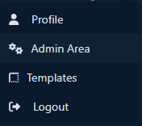
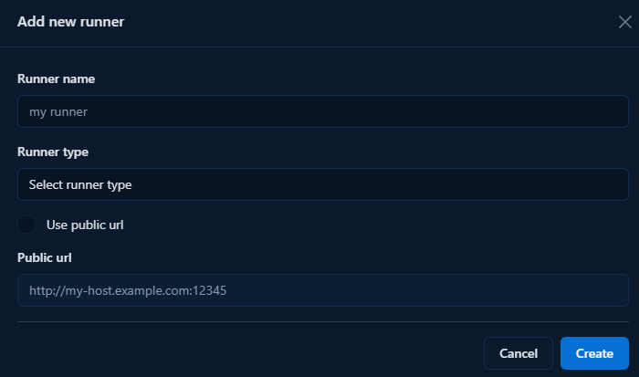

# Quickstart

To run workspaces, a runner is required. The runner connects to the Codebox server and is used to manage workspaces. You can find a guide here on how to set up a runner.

```{warning}
   A runner can be connected to only one server. If you want to share a machine across multiple Codebox instances, you need to define a separate runner for each instance.
```

## Registration of a new runner

Before starting a new runner instance, you must first create it on the Codebox server. This process will generate a token and an ID for the runner. You can find a guide on how to create a new runner here.

```{warning}
   A runner can be registered only by administrators.
```

1. Go to the Admin Area by clicking on 'Admin Area' in the dropdown menu under your user details in the top-right corner.



2. Under the section 'Runners' click on 'Add new runner'


3. Enter the name and type of the runner. If you want to use a public URL, also provide the runner's public URL. (Note: using a public URL is more stable but requires that the server can reach the runner.)



4. Copy the ID and token — you're now ready to install the Runner.

## Installation
The recommended installation procedure involves using the Docker stack defined in the `docker-compose.yml` file found in the [runner repository](https://gitlab.com/codebox4073715/codebox-docker-runner).

```{warning}
   Docker and Docker Compose are required, please install them before proceeding
```

To install Codebox Runner, the first step is to download the docker-compose.yml file using the following command:

```bash
wget https://gitlab.com/api/v4/projects/69007830/repository/files/docker-compose.yml/raw?ref=main -O docker-compose.yml
```
or if you prefer to use curl:
```bash
curl --output docker-compose.yml "https://gitlab.com/api/v4/projects/69007830/repository/files/docker-compose.yml/raw?ref=main"
```

The stack requires some configuration provided by environment variables to start:

- `CODEBOX_SERVER_URL`: the URL of the Codebox instance where the runner is registered.
- `CODEBOX_RUNNER_ID`: the unique ID of the runner.
- `CODEBOX_TOKEN`: the token used to authenticate the runner with the server.
- `CODEBOX_RUNNER_EXTERNAL_URL`: the public URL of the runner. Agents running inside containers or VMs will use this URL to connect back to the runner
- `CODEBOX_OBJECTS_PREFIX`: a prefix added to the names of generated objects. Change this if you're running multiple runners on the same machine to avoid naming conflicts.
- `CODEBOX_RUNNER_EXPOSED_PORT`: the external port on which the runner is exposed.

Now you can start your docker stack:
```
docker compose up
```

```{note}
You can also launch a codebox runner using Portainer by creating a new stack and copying the contents of the `docker-compose.yml` file.
```